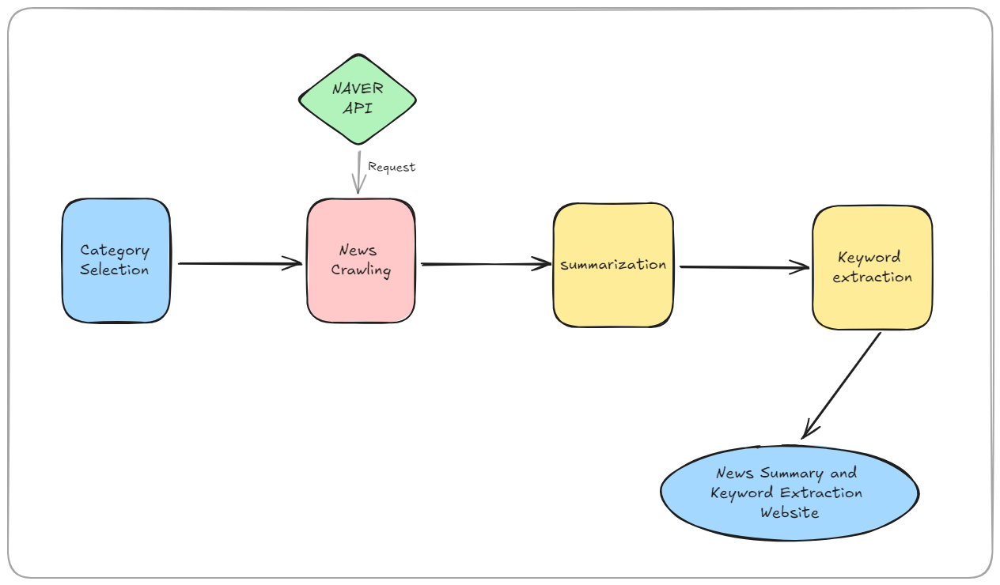

# 📰News_Summarizer

 💡Project Introduction 
-------------

✔Produces a summary of news articles and automatically generates key keywords, and implements a Streamlit-based UI

🌏Development Environment
-------------

✔News Model Development

-Jupyter Notebook

-Colab

-Python

✔UI Implementation

-Streamlit

-Java

-Ollama

🗝Key features
-------------

•Select News Category: Economy, IT, Science, Society, Culture, Sports, Health

•Collect 5 popular news articles from selected categories

•Generating a summary of each article

•Extract the key keywords for each article

•Use Ollama to summarize and translate articles

•Visualize Results (Output)

👾Model Realization
-------------

•Design a web or mobile interface that allows users to select categories and view results

•apa: Summarize news articles and extract key keywords

•apf: Use Ollama to summarize news points

💻Architecture
------------

### ✔News Crawler

•Source

-Naver News API (free for 25k requests)

-Ollama API

### ✔News Analyzer

•html.paser: parsing

### ✔News Summarizer

•Korean Tokenizer: text -> sentence separation

•Huggingface: Using the News Summary Model

-Korean text summary by loading t5-based model

### ✔Keyword Extractor

•Okt(Open Korean Text): Extract key keywords from text

### ✔UI Implementation

•Implement Web pages in streamlit using Konlpy

•Implement web pages with streamlit with newly written code with ollama -> Improve performance

🧗‍♀️Future Work
-------------

•Troubleshooting Occasional Unrelated News

•Troubleshoot summary errors that often occur in the middle of using the apa code

•Use Ollama to extract even the core keywords of the news

•Solve the disadvantage that only users can enter web pages

•Shorten news summary extraction time
